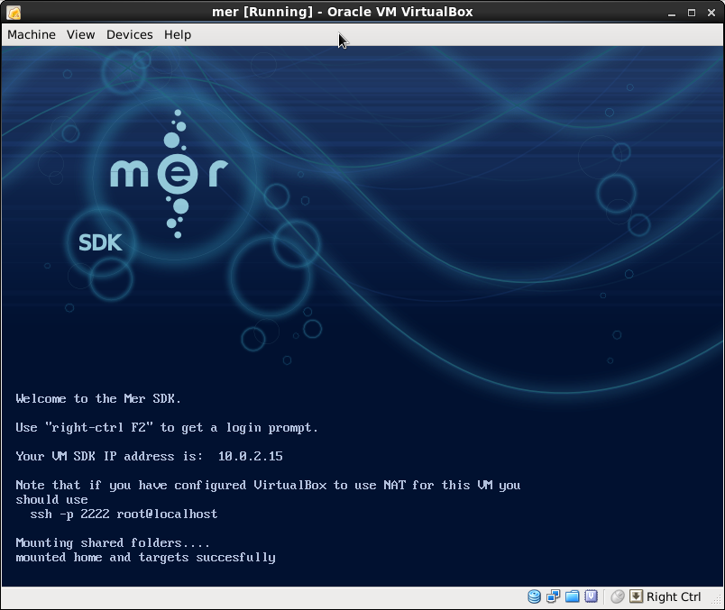
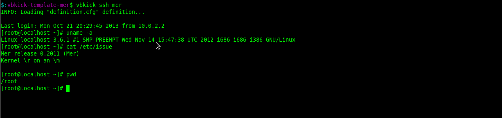
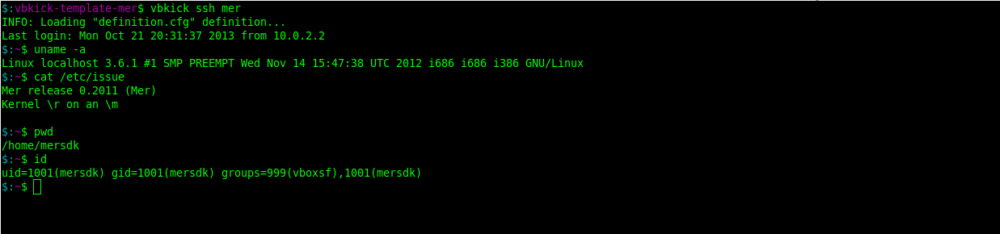

# Description

Mer SDK [vbkick](https://github.com/wilas/vbkick) template. Help creates VBox VM Guests. Vbkick SSH insecure keys are used.
More: [Platform_SDK_on_VirtualBox](https://wiki.merproject.org/wiki/Platform_SDK_on_VirtualBox)

## Howto

### choose definition (change the target of a symlink)
```
    ln -fs vbmachine-mersdk.cfg vbmachine.cfg
```

### create the new VM (child steps)
```
    vbkick  build           mer
    vbkick  postinstall     mer     # this is not needed for root definition
```

### playing with new VMs
```
    vbkick  build           mer
    vbkick  ssh             mer     # as ssh_user="root" in vbmachine.cfg
    vbkick  postinstall     mer     # here are prepared ssh keys for "mersdk" user
    vbkick  ssh             mer     # as ssh_user="mersdk" in vbmachine.cfg (you need to uncomment sth. in vbmachine.cfg)
    vbkick  destroy         mer
```

#### Mer after build



#### Mer after postinstall - root user



#### Mer after postinstall - mersdk user



