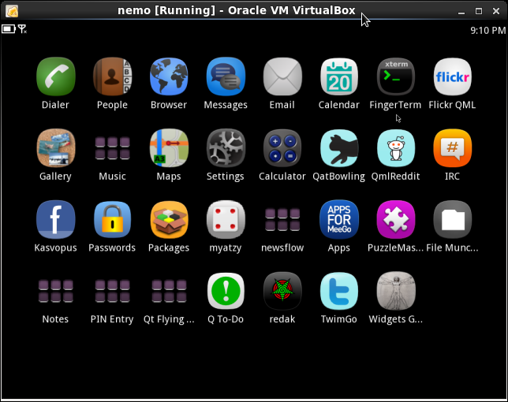
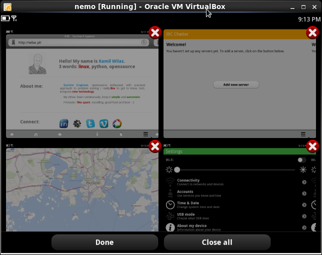

# Description

Nemo Mobile [vbkick](https://github.com/wilas/vbkick) template. Help creates VBox VM Guests.
More: [Nemo VM on Virtualbox](http://xavinux.blogspot.co.uk/2013/06/installing-nemo-vm-on-virtualbox.html)

## Howto

### choose definition (change the target of a symlink)
```
    ln -fs definition-i486.cfg definition.cfg
```

### create the new VM (child steps)
```
    vbkick  build           nemo
    vbkick  postinstall     nemo     # install postinstall scripts - in this case postinstall/update.sh (update nemo)
```

### playing with the new VM (more fun is with the GUI)
```
    vbkick  build           nemo
    vbkick  postinstall     nemo     # update is done here
    vbkick  ssh             nemo     # as ssh_user="root" in definition
    vbkick  destroy         nemo
```

#### Nemo dashboard



#### Nemo apps



