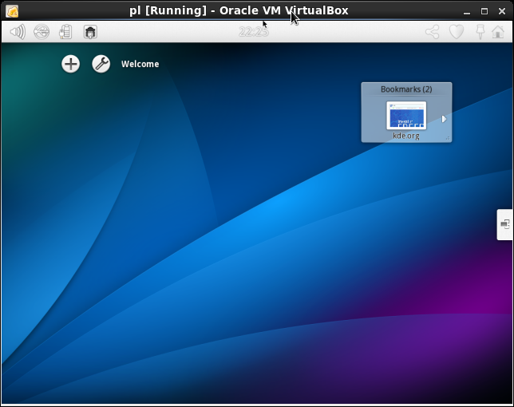
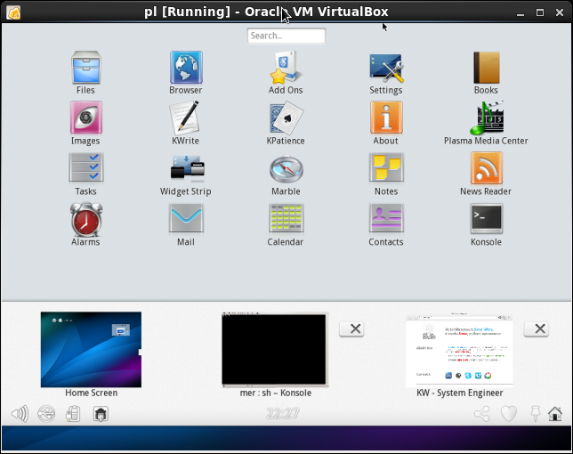
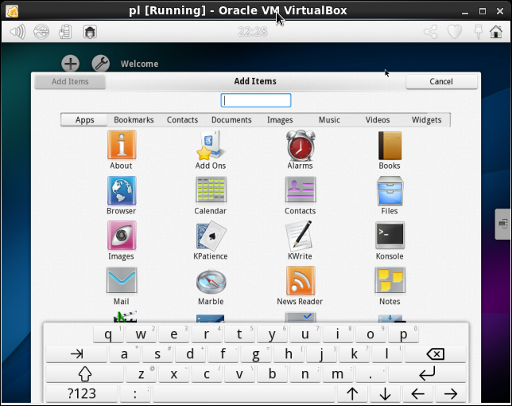

# Description

Plasma Active [vbkick](https://github.com/wilas/vbkick) template. Help creates VBox VM Guests.
More: [Plasma_Active_on_VirtualBox](http://community.kde.org/Plasma/Active/VirtualBox)

## Howto

### create the new VM (child steps)
```
    vbkick  build           plas
    vbkick  postinstall     plas    # update, setup cursor and render backend
```

### playing with the new VM (more fun is with the GUI)
```
    vbkick  build           plas
    vbkick  postinstall     plas    # update and other tuning is done here
    vbkick  ssh             plas    # as ssh_user="root" in vbmachine.cfg
    vbkick  destroy         plas
```

#### Plasma Active Home Screen



#### Plasma Active Menu



#### Plasma Active Add Items



#### Plasma Active Activity


