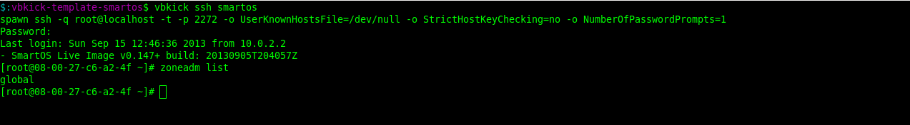
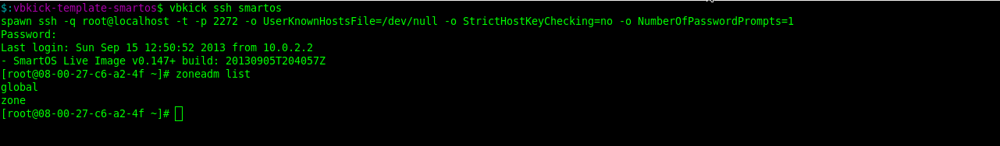
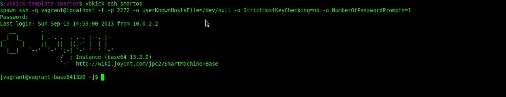

# Description

SmartOS [vbkick](https://github.com/wilas/vbkick) template. Helps create a new SmartOS VBox machine.

## Howto

### choose definition (change the target of a symlink)
```
    ln -fs vbmachine-iso-dhcp.cfg vbmachine.cfg
```

### create and play with the new VM
```
    vbkick  build       SmartOS_box

    vbkick  ssh         SmartOS_box
    vbkick  snap        SmartOS_box
    vbkick  ssh         SmartOS_box
    vbkick  shutdown    SmartOS_box

    vbkick  resnap      SmartOS_box
    vbkick  on          SmartOS_box
```

### create and play with the new vagrant base box
```
    vbkick  build        SmartOS_box
    vbkick  postinstall  SmartOS_box    #here is created "Vagrant SmartMachine"
    vbkick  ssh          SmartOS_box    #as ssh_user="root" in vbmachine.cfg
    $ zoneadm list                      #on Guest VM, should list zone with "zone" name
    vbkick  shutdown     SmartOS_box
    vbkick  export       SmartOS_box

    vagrant box add smartos SmartOS_box.box
    vagrant box list

    vbkick  on           SmartOS_box    #start VM
    vbkick  ssh          SmartOS_box    #ssh to Vagrant SmartMachine" as ssh_user="vagrant" (NB. update vbmachine.cfg before this step)
```


#### SmartOS after build



#### SmartOS after postinstall



#### SmartOS "Vagrant SmartMachine"




### About definitions
usb - mean USB image is use to create boot disk

iso - boot from iso file

dhcp - use dhcp as the IP address

**vbmachine-usb-dhcp.cfg** & **vbmachine-iso-dhcp.cfg** - postinstall is not needed, creates basic SmartOS (no vagrant), allow login to GlobalZone as root (vbkick ssh SmartOS_box)

**vbmachine-usb-dhcp-vagrant.cfg** & **vbmachine-iso-dhcp-vagrant.cfg** - creates vagrant SmartMachine in postinstall step (famous @aszeszo script is used - look to postinstall/vagrant.sh)

### Note
 - Sometimes after creating "Vagrant SmartMachine" and reboot, SmartOS starting crash and "vagrant zone" is gone.
